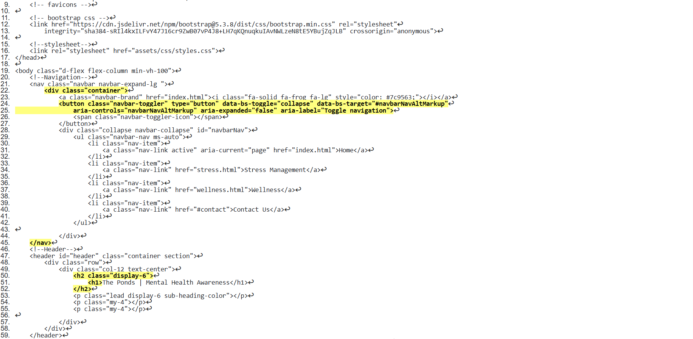

# mental-health-awareness

## About this project

This project is the first personal project done without a walkthrough guide.
This project goal is to produce a static website that is accessible, responsive, with working links.
The topic is mental health awareness. 
This project uses HTML and CSS. Bootstrap, co-pilot and prievious project have been used as aids for this project.   
## User Stories

1. As a First-Time Visitor, I need easy navigation and a user-friendly design, including a responsive layout for my device, so I can find information quickly and efficiently without frustration.

2. As a first-time visitor I want a clear, friendly overview of mental health basics so that I can quickly understand common issues and where to start.

3. As someone looking for stress management I want short, practical coping techniques and step‑by‑step exercises.

## Beginning Notes

Created a Github project board.
Used co-pilot to create user stories.
Used The Broadwalk Games project board as a reference.

## Balsamiq Wireframes

## Co-pilot
Create user stories:
AS A first-time visitor I WANT A clear, friendly overview of mental health basics SO THAT I CAN quickly understand common issues and where to start. The user needs are: plain‑spoken summaries, prominent section headings, a simple site map, short intro text, calming tone, and clear "Learn more" links.

AS A person noticing symptoms I WANT concise lists of common signs and red flags SO THAT I CAN recognize when self‑care is enough and when to seek help. The user needs are: symptom checklists, "when to get help" guidance, next steps (talk to someone/seek professional), and crisis helpline links.

AS SOMEONE LOOKING FOR STRESS MANAGEMENT I WANT short, practical coping techniques and step‑by‑step exercises SO THAT I CAN try tools immediately. The user needs are: quick breathing/grounding exercises, short guided routines, printable/print‑friendly cards, and calming visuals.

AS A MOBILE USER I WANT a responsive, fast, easy‑to‑navigate site SO THAT I CAN access information quickly on my phone. The user needs are: Bootstrap responsive layout, collapsed navigation, large touch targets, minimal heavy images, and fast load times.

AS A USER WITH ACCESSIBILITY NEEDS I WANT semantic, screen‑reader friendly markup and adjustable presentation SO THAT I CAN read and navigate the site comfortably. The user needs are: proper headings, alt text, ARIA where appropriate, skip navigation, keyboard focus states, high‑contrast mode and scalable fonts.

AS A CAREGIVER OR FAMILY MEMBER I WANT guidance on how to support someone SO THAT I CAN respond sensitively and effectively. The user needs are: communication tips, do/don't lists, referral suggestions, and links to family resources.

AS A SITE OWNER I WANT to build a calm, well‑organised static site using HTML, CSS and Bootstrap SO THAT I CAN provide beginner‑friendly mental health information in an accessible format. The user needs are: a reusable Bootstrap template, modular CSS variables for a calming palette, accessible components, responsive layout patterns, easy content sections (hero, topics, coping tips, resources, footer), and simple instructions for content updates

Use of the suggestion in the html pages.

## Code Resources

Referenced the Boardwalk Games project code.

## Website Iterations 

Changed Safe landings to Stress Management to be clearer to first time users.
Changed Wellness Tips to Wellness to match the navbar.

### Responsive tests
 
 
 
 
 
 

## Bugs

Empty card div ontop of the stress manangement card div. The stress management div was inside of the empty card div.

Collasped Navbar is broken. Used W3C validator to check the index.html. 

Removed h1 tag.

Fixed aria-controls, the div id is now the same as the aria-controls.

Closed open div container tag inside the nav div.

Fixed navbar dropdown. The data-bs-target matches the div class="collapse navbar-collapse" id="navbarNav".

Background of the navbar doesn't stretch across the top of the page.
 

Fixed the home cards layout: Add padding-bottom:29px;

Fixed the home cards layout: Add margin left 18px;

## Lighthouse

## Code Validation
Used Rocket Validator to clarify the W3C validator corrections.

## Review

Now at the end of this project, it is clear that using the lighthouse to check my website should have been done much earlier. As making small changes to the code often has a ripple effect. 

